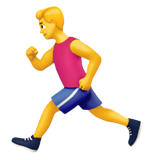

---
# You don't need to edit this file, it's empty on purpose.
# Edit theme's home layout instead if you wanna make some changes
# See: https://jekyllrb.com/docs/themes/#overriding-theme-defaults
layout: home
exclude: true
---

# Dive into running data in Switzerland

Analysis and visualization of running data from [Datasport](http://datasport.com).

[Study Lausanne Marathon 2016](/lausanne){:.home-nav}
[Explore runners data](/runners){:.home-nav}
[Explore races data](/races){:.home-nav}

